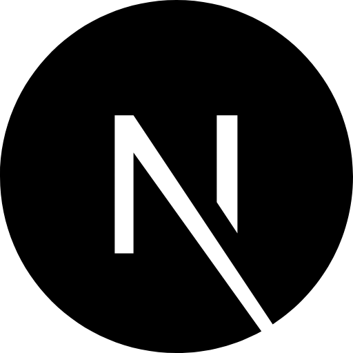
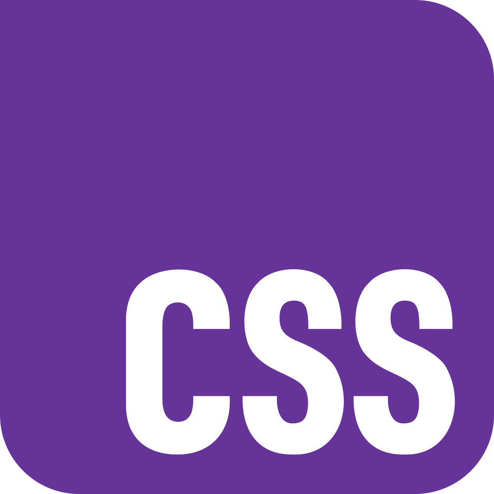

# 👋 Hi there! I'm Rigo Mejia
Welcome to my GitHub! Check out the projects I've been working on.
If you'd like to connect, feel free to reach out on [Linkedin](https://www.linkedin.com/in/rigoberto-mejia/)!
# 🛠️ Favorite Tech
Langauges, tools, and other things I enjoy working with

<span>
    
</span>
<span>
    
</span>
<span>
    
</span>
<span>
    
</span>
<span>
    
</span>
<span>
    
</span>
<span>
    
</span>
<span>
    
</span>
<span>
    
</span>
<span>
    
</span>
<span>
    
</span>
<span>
    
</span>
<span>
    
</span>
<span>
    
</span>
<span>
    
</span>
<span>
    
</span>
<span>
    
</span>
<span>
    
</span>
<br></br>


# 🚀 Favorite Projects
## [Rock Radar](https://github.com/rmejia4209/Rock-Radar)
Rock Radar
A PyQt5 desktop application that helps climbers compare rock climbing crags by
filtering and sorting routes based on route metrics and density. The app
leverages BeautifulSoup for web scraping and QThreads for smooth background
processing, ensuring a responsive user experience.
## [Airwaves and Beats](https://github.com/rmejia4209/Airwaves-and-Beats)
This app plays lofi beats over live air traffic control. It's inspired by
[Lofiatc](https://www.lofiatc.com/?icao=panc), which has been down since
[LiveATC](https://www.liveatc.net) blocked its traffic.

I built this project to explore the fundamentals of HTML, CSS, and JavaScript
by creating a simple, framework-free frontend. The backend uses Express to
serve media and a proxy to stream the air traffic control feed. 

> Please consider signing the
> [petition](https://docs.google.com/forms/d/e/1FAIpQLScRl0rGNB80kkgqyWphh3PxdNlomkQ3RQkiVjyWUmmHgqyevQ/viewform)
> with your email to help the site's owner regain access to LiveATC.

# 📈 Stats
 
<!--START_SECTION:waka-->


**I'm a Night 🦉** 

```text
🌞 Morning                138 commits         ⣿⣿⣀⣀⣀⣀⣀⣀⣀⣀⣀⣀⣀⣀⣀⣀⣀⣀⣀⣀⣀⣀⣀⣀⣀   06.41 % 
🌆 Daytime                884 commits         ⣿⣿⣿⣿⣿⣿⣿⣿⣿⣿⣀⣀⣀⣀⣀⣀⣀⣀⣀⣀⣀⣀⣀⣀⣀   41.04 % 
🌃 Evening                1097 commits        ⣿⣿⣿⣿⣿⣿⣿⣿⣿⣿⣿⣿⣿⣀⣀⣀⣀⣀⣀⣀⣀⣀⣀⣀⣀   50.93 % 
🌙 Night                  35 commits          ⣀⣀⣀⣀⣀⣀⣀⣀⣀⣀⣀⣀⣀⣀⣀⣀⣀⣀⣀⣀⣀⣀⣀⣀⣀   01.62 % 
```


📊 **This Week I Spent My Time On** 

```text
🕑︎ Time Zone: America/Chicago

💬 Programming Languages: 
Python                   29 mins             ⣿⣿⣿⣿⣿⣿⣿⣿⣿⣿⣿⣿⣿⣿⣿⣿⣿⣿⣿⣿⣿⣿⣿⣿⣿   100.00 % 

💻 Operating System: 
Mac                      29 mins             ⣿⣿⣿⣿⣿⣿⣿⣿⣿⣿⣿⣿⣿⣿⣿⣿⣿⣿⣿⣿⣿⣿⣿⣿⣿   100.00 % 
```


 Last Updated on 09/04/2025 01:51:34 UTC
<!--END_SECTION:waka-->

